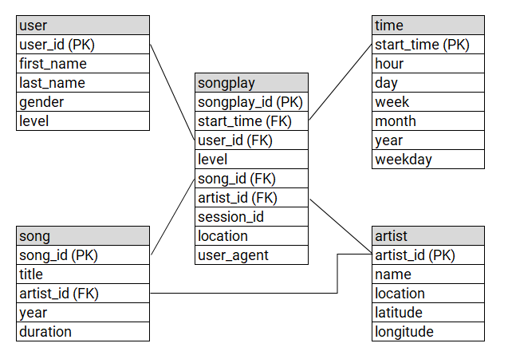

## Introduction

A music streaming startup, Sparkify, has grown their user base and song database and want to move their processes and data onto the cloud. Their data resides in S3, in a directory of JSON logs on user activity on the app, as well as a directory with JSON metadata on the songs in their app.

The goal is to create an ETL pipeline to move the data from the S3 buckets to an Amazon Redshift database.

## How to Run the Python Scripts
The python scripts can be run directly through the terminal. For example, `python sql_queries.py`. For convenience/flow, they can also be run within a Jupyter Notebook cell with `%run filename.py`.

To complete the ETL pipeline, 4 scripts should be run in the following order: 
1) clusterprepare.py 
2) create_tables.py  
3) etl.py  
4) clusterdelete.py  

## Files in Repository

*Notebooks*  
**build.ipynb**:  Runs the scripts in the correct order. Unnecessary - can be run through terminal, but was helpful for debugging.  
**s3access.ipynb**:  Shows examples of both the song data and the log data from the S3 bucket.

*Scripts*  
**clusterprepare.py**: Create AWS IAM Role with Read Only Access to S3, then Create a Redshift Cluster  
**create_tables**.py: Drop existing SQL tables (if present) to clear the workspace then create/recreate the tables to prepare for loading data.  
**etl.py**: This loads the staging tables from S3 to Redshift and writes the data from the staging tables into the SQL star schema centered around the songplay table tracking user sessions and each play of a song.  
**clusterdelete**.py: Delete IAM Role and Redshift Cluster.  
**myfunctions.py**: A couple of functions for reviewing cluster properties.  

*Config*  
**dwh.cfg**: Configuration information for AWS/Redshift Cluster/DB

## Schema Design/Pipeline

The songplay table is our core table with each song play recorded. It has multiple foreign keys corresponding to the "points" in this schema. Information about songs, artists, users, and additional time fields are available to be joined to songplay using additional tables.

To create these tables, the user/song/artist/time table fields are extracted from song and log data staging tables after the tables are copied from an S3 bucket.